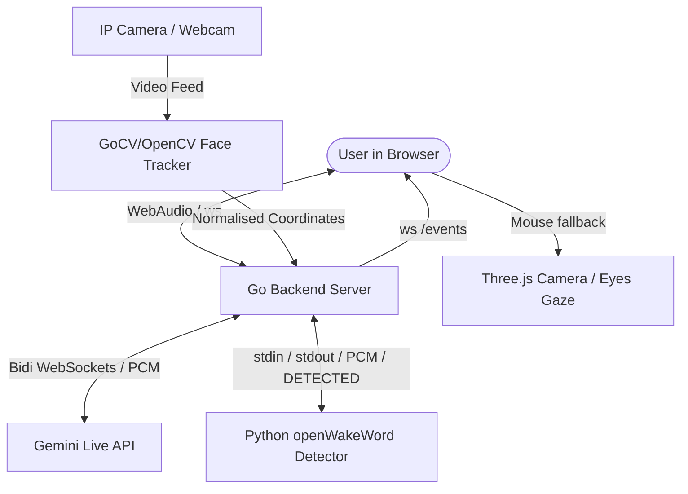

# 🤖 LLM context for Project Cassandra

Welcome, AI Assistant! This document serves as a comprehensive system orientation and developer context file. Read this to understand the codebase architecture, files, API contracts, build flags, and developer workflows of **Cassandra**.

---

## 📌 Project Overview
**Cassandra** is a high-performance, real-time interactive 3D Web application that integrates:
1.  **3D Graphics & Animations**: A 3D model of the robot modeled in vanilla Three.js.
2.  **Conversational Live Voice (Google Gemini Multimodal Live API)**: Bidirectional, low-latency voice-to-voice communication using WebSockets streaming raw PCM audio chunks.
3.  **Real-Time Computer Vision & Face Tracking**: A backend Go service that grabs video frames from a camera feed, detects human faces using OpenCV (`CascadeClassifier`), and relays normalised coordinates to Three.js to move Bender's gaze and camera perspective in real-time.
4.  **Local Deep-Learning Wake Word Detection**: A real-time keyword spotting engine running locally via Python (`openwakeword` + `onnxruntime` + custom ONNX models) bridged to Go through an isolated stdin/stdout pipe.

---

## ⚙️ Core Architecture & Data Flow



1.  **Wake Word Detection Pipeline**: User connects to WebSocket `/ws` -> backend starts an isolated `python wakeword_detector.py` subprocess -> browser streams 16kHz 16-bit PCM mono audio chunks -> Go server forwards PCM bytes directly to Python process's `stdin` -> `wakeword_detector.py` runs deep learning inference using local ONNX model -> once score exceeds threshold, Python outputs `DETECTED:<score>` to `stdout` -> Go server detects the signal, triggers the acoustic chime in the browser, and activates Gemini.
2.  **Audio Pipeline (Active)**: Gemini Live connected -> Go server forwards client's incoming PCM directly to Gemini Live WebSocket (`v1alpha`) -> Gemini responds with PCM (24kHz, 16-bit mono) -> Go server relays to browser -> browser plays audio queue using AudioContext.
3.  **Initiating Greeting**: Upon Gemini Live activation, the Go backend automatically injects a `clientContent` turn saying `"Diga exatamente: 'Como posso ajudar?'"`, prompting the model to start speaking immediately, reducing latency and eliminating initial silence.
4.  **Tracking Pipeline**: OpenCV processes feed -> calculates normalised center `(x, y)` between `-1.0` and `1.0` -> broadcasts over WebSocket `/events` -> Three.js updates camera position and robot mesh rotation.

---

## 📁 Repository File Mapping

*   **`main.go`**: Core HTTP server, WebSocket upgrader, and gateway routing `/ws` to Gemini/WakeWord and `/events` to the frontend.
*   **`wakeword_detector.py`**: Python script executing real-time openwakeword inference using ONNX Runtime.
*   **`system_prompt.md`**: Dedicated markdown file storing the system prompt/personality of the robot, loaded dynamically on connection.
*   **`models/`**: Centralized folder containing ONNX and TFLite wake word model files (e.g. `edna.onnx`, `ok_bender.onnx`).
*   **`tracker.go`** (Build Tag `gocv`): Implements `FaceTracker` using native OpenCV bindings (`gocv.io/x/gocv`).
*   **`tracker_mock.go`** (Build Tag `!gocv`): Fallback mock `FaceTracker` ensuring zero compile-time dependencies on OpenCV for quick local development.
*   **`web/`**: Dedicated directory containing static frontend assets:
    *   `index.html`: Entry structure.
    *   `main.js`: Main Three.js loop, camera physics, robot rendering, mesh blinking logic, local AudioContext chimes, and event listeners.
    *   `live_client.js`: Captures browser microphone feed and schedules incoming raw PCM audio playbacks.
    *   `style.css`: Clean, modern styling.
    *   `ai_studio.js`: Standalone legacy helper for HTTP fallback.

---

## 🧩 Build Flags & OpenCV Constraints

Because OpenCV and `gocv` setup is complex on Windows/macOS, we utilize **Go Build Tags** to keep compilation simple:

*   **Mock Mode (Default / No Dependencies)**:
    Compile/run using standard commands. It compiles `main.go` + `tracker_mock.go`:
    ```bash
    go run .
    ```
*   **Production/GoCV Mode (Requires OpenCV/GoCV installed)**:
    Compile/run using the `gocv` tag. It compiles `main.go` + `tracker.go`:
    ```bash
    go run -tags gocv .
    ```

---

## 🔑 Environment Variables (`.env`)

All configurations must be loaded exclusively from the environment. Never hardcode credentials or URLs.

```env
# Credentials
GEMINI_API_KEY=AIzaSy...              # Google AI Studio API Key

# Server Ports
PORT=8080                             # Go WebSocket Server port

# Face Tracking
TRACKER_STREAM_URL=0                  # '0' for local webcam, or HTTP URL for IP camera
TRACKER_CASCADE_FILE=haarcascade_frontalface_default.xml

# Gemini Live Configuration
GEMINI_LIVE_URL=wss://generativelanguage.googleapis.com/ws/google.ai.generativelanguage.v1alpha.GenerativeService.BidiGenerateContent
GEMINI_MODEL=models/gemini-3.1-flash-live-preview
GEMINI_VOICE_NAME=Puck                 # Voice options: Puck, Charon, Kore, Fenrir, Aoede
GEMINI_SYSTEM_INSTRUCTION=You are Bender...

# Wake Word Configuration
WAKEWORD_MODEL_PATH=models/ok_bender.onnx
WAKEWORD_THRESHOLD=0.8
```

---

## 📡 API & WebSocket Protocols

### 1. Client WebSocket to Go Server (`/ws`)
*   **Upstream (Client -> Server -> Gemini)**:
    JSON payload sending microphone bytes:
    ```json
    {
      "type": "audio",
      "data": "Base64EncodedPCM16kHz"
    }
    ```
*   **Downstream (Gemini -> Server -> Client)**:
    JSON responses with audio output:
    ```json
    {
      "type": "audio",
      "data": "Base64EncodedPCM24kHz"
    }
    ```
    JSON text responses:
    ```json
    {
      "type": "text",
      "data": "Robot text transcription"
    }
    ```
    WebSocket status triggers:
    ```json
    {
      "type": "wake_word_detected",
      "data": "active"  // 'active' or 'idle'
    }
    ```

### 2. Events Broadcast (`/events`)
Sends real-time face coordinates:
```json
{
  "type": "face",
  "x": -0.456,
  "y": 0.123
}
```

---

## 📝 Guidelines for future AI Agents / LLMs

1.  **Maintain Environment Isolation**: If you add any configuration variables, declare them in `.env.example`, document them in `README.md`, and fetch them using `os.Getenv` (Go).
2.  **Preserve Fallback Compilation**: Ensure that any changes to `FaceTracker` or camera routines do not break `tracker_mock.go` compilation. Keep the tag signature `//go:build !gocv` clean.
3.  **UI Assets Directory**: Static files must strictly live inside `/web` directory. If you create new images or CSS/JS utilities, place them there.
4.  **Three.js Customisations**: Keep Bender's styling aligned with glassmorphism and modern colors. Coordinate scales should match target ranges:
    *   Horizontal coordinates: `-1.0` (Left) to `1.0` (Right).
    *   Vertical coordinates: `-1.0` (Bottom) to `1.0` (Top).
5.  **Wake Word Model Management**: When updating the models, ensure they are placed inside the `models/` directory, and avoid creating files directly in the root namespace.
